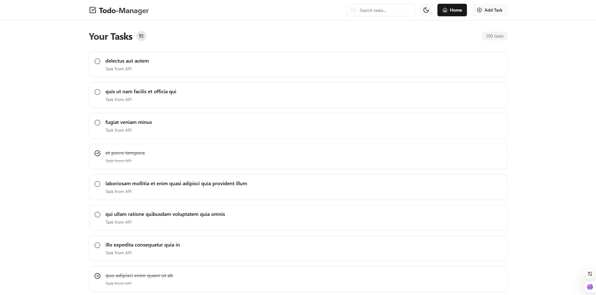

# Todo-Manager

A modern, responsive task management application built with React, Redux Toolkit, and Framer Motion. Features a beautiful UI with smooth animations, dark mode support, and real-time task filtering.



## 🌟 Features

- ✨ Modern and responsive UI with smooth animations
- 🌓 Dark mode support with system preference detection
- 🔍 Real-time task search and filtering
- ✅ Task completion tracking
- ✏️ Edit existing tasks
- 🗑️ Delete tasks
- 📱 Mobile-friendly design
- 💾 Local storage persistence
- 🔄 API integration with fallback support

## 🛠️ Technologies Used

- React.js
- Redux Toolkit for state management
- React Router for navigation
- Framer Motion for animations
- Tailwind CSS for styling
- Lucide React for icons
- React Hot Toast for notifications

## 🚀 Getting Started

### Prerequisites

- Node.js (version 14 or higher)
- npm or yarn

### Installation

1. Clone the repository:

```bash
git clone https://github.com/your-username/todo-manager.git

```

2. Navigate to the project directory:

```shellscript
cd todo-manager
```

3. Install dependencies:

```shellscript
npm install
```

4. Start the development server:

```shellscript
npm start
```

5. Open [http://localhost:3000](http://localhost:3000) to view it in your browser.

## 🏗️ Project Structure

```plaintext
src/
│
├── components/
│   ├── Header.js          # Navigation and app header
│   ├── TaskList.js        # Displays list of tasks
│   ├── TaskForm.js        # Form for creating/editing tasks
│   ├── TaskItem.js        # Individual task component
│   └── SearchBar.js       # Search functionality
│
├── features/
│   └── tasks/
│       ├── taskSlice.js   # Redux state management
│       └── taskAPI.js     # API and localStorage handling
│
├── pages/
│   ├── HomePage.js        # Main task listing page
│   ├── AddTaskPage.js     # Add new task page
│   └── EditTaskPage.js    # Edit existing task page
│
├── App.js                 # Main app component
├── index.js              # Entry point
└── store.js             # Redux store configuration
```

## 💾 Data Persistence

The application uses a hybrid approach for data management:

1. Fetches initial data from JSONPlaceholder API
2. Stores all data in localStorage for persistence
3. Maintains state using Redux Toolkit
4. Handles offline functionality with fallback mechanisms

## 🎨 Customization

### Styling

The application uses Tailwind CSS for styling. You can customize the look and feel by modifying:

- `tailwind.config.js` for theme configuration
- `index.css` for global styles and dark mode variables
- Individual component styles using Tailwind classes

### Colors

The default color scheme can be modified in the `index.css` file under the `:root` and `.dark` selectors.

## 🔧 Development

### Available Scripts

- `npm start` - Runs the app in development mode
- `npm test` - Launches the test runner
- `npm run build` - Builds the app for production
- `npm run eject` - Ejects from Create React App

### Best Practices

- Follow the existing code structure and naming conventions
- Use meaningful component and variable names
- Write comments for complex logic
- Maintain proper error handling
- Keep components small and focused
- Use TypeScript for better type safety

## 🤝 Contributing

1. Fork the repository
2. Create your feature branch (`git checkout -b feature/AmazingFeature`)
3. Commit your changes (`git commit -m 'Add some AmazingFeature'`)
4. Push to the branch (`git push origin feature/AmazingFeature`)
5. Open a Pull Request

## 📝 License

This project is licensed under the MIT License - see the [LICENSE](LICENSE) file for details.

## 🙏 Acknowledgments

- [Tailwind CSS](https://tailwindcss.com)
- [Framer Motion](https://www.framer.com/motion)
- [Redux Toolkit](https://redux-toolkit.js.org)
- [React Router](https://reactrouter.com)
- [Lucide Icons](https://lucide.dev)
- [JSONPlaceholder](https://jsonplaceholder.typicode.com)

## 📧 Contact

Your Name - [your.email@example.com](mailto:shiveejaiswal25@gmail.com)

Project Link: [https://github.com/shiveejaiswal/todo-manager](https://github.com/shiveejaiswal/todo-manager)
